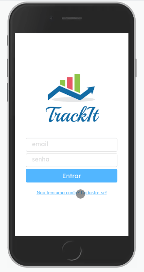
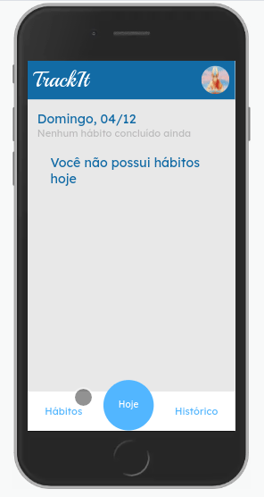
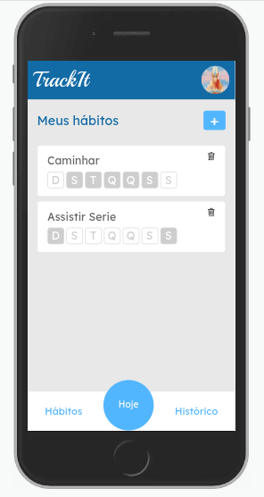

# projeto TrackIt

<div align="center">

  <h3>Built With</h3>

  
  
</div>

<br/>

# Descrição

TrackIt é uma aplicação de acompanhamento de hábitos.

</br>

## Funcionalidades

- Criar uma conta e acessá-la
- Criar um hábito
- Marcar ou desmarcar um hábito feito.
- Visualizar o histórico de hábitos

</br>

## Rotas

### rotas de autenticação

São as rotas / (login) e /cadastro (cadastro)

<h1 align="center" >

</h1>

#

### /habitos

Nessa rota é onde se gerencia os hábitos

Nela é possivel:

- Visualizar todos os hábitos criados pelo usuário.
- Criar um hábito.
- Deletar um hábito.

<h1 align="center" >

</h1>

#

### /hoje

Nessa rota é onde se gerencia os hábitos de hoje.

Nela é possivel:

- Visualizar os hábitos de hoje.
- Marcar os hábitos como feito.
- Desmarcar um hábito feito como não feito.

<h1 align="center" >

</h1>

#

### /historico

Nessa rota é possivel visualizar o histórico dos hábitos.

Nela é possivel:

- Clicar nos dias para listar quais hábitos foi concluido e quais não foram

<h1 align="center" >

</h1>

#

## Rodar localmente

Clone o projeto

```bash
  git clone https://github.com/ThVinicius/TrackIt.git
```

Vá para o diretorio do projeto

```bash
  cd TrackIt
```

Instale as dependencias

```bash
  npm install
```

Inicie o servidor

```bash
  npm start
```

#

## Acknowledgements

- [Awesome Badges](https://github.com/Envoy-VC/awesome-badges)

</br>
